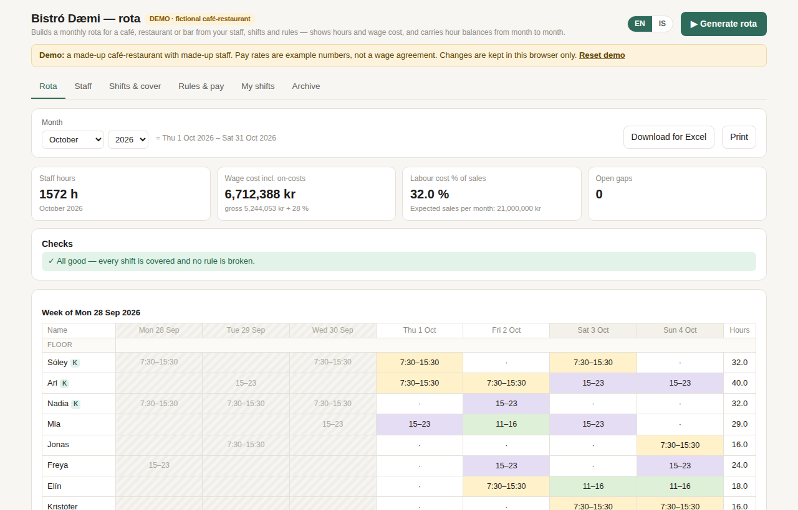
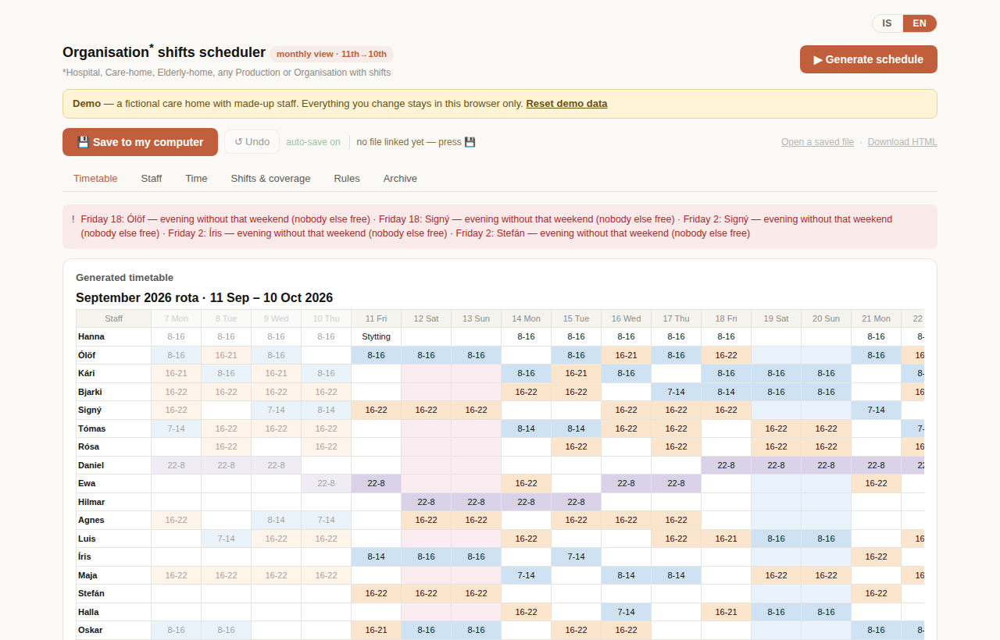

# Staff Shift Scheduler

Rota generators that run in the browser. You describe your staff, the cover you need and your rules, and the tool builds a month of shifts, checks it against the rules and shows each person's hours balance. Each demo is a single self-contained HTML file: no install, no server, no account.

**Live demos:** open `index.html`, or the GitHub Pages site for this repository.

| Demo | For | Folder |
|---|---|---|
| **Café & restaurant** (Bistró Dæmi) | cafés, restaurants, bars, 8–25 staff | [`hospitality/`](hospitality/) |
| **Care home** (24/7) | care homes, residential units, any 24/7 shift work | [`care-home/`](care-home/) |

## Café & restaurant demo

- **Monthly rota** built from each person's contract hours, availability, the shift types they can take, and the cover needed per shift, day and area (floor / kitchen).
- **Rules the generator never breaks:** minimum rest between shifts (11 h), maximum days in a row (5), each person's weekly maximum, a key-holder on every opening and closing shift. These hold across the change of month too.
- **Balancing:** after filling the rota, shifts are moved one at a time from whoever is over target to whoever is under, without breaking any rule. Salaried staff come first.
- **Close the month:** files the month in an Archive (rota, staff, pay rates, hours and cost, frozen as they were) and carries each salaried person's hour balance into the next month. Undo included.
- **Wage cost incl. employer on-costs**, and labour cost as a % of expected sales.
- **Hour weights (vægi)** for evening, weekend and public holiday hours (1.00 = off). They count toward hours owed, not pay.
- **My shifts:** one person's shifts in a phone-friendly list, copyable into a message.
- Click any cell to change a shift; checks, hours and cost update straight away. Excel (CSV) export, print, Icelandic/English.

## Care-home demo

- Day, evening and night shifts across a pay period running from the 11th to the 10th.
- A night person every night, a supervisor each weekday, one 7:00 opener, 11-hour rest, a limit on days in a row, weekends kept in pairs.
- Fixed patterns kept exactly; everyone else scheduled around them.
- Weighted hours (evening, weekend, night, public holiday) and a balance per person.
- Month archive with carry-forward, saving to a file on your computer (File System Access API, with a download fallback), Icelandic/English.

## Data & privacy

- Both demos use **fictional names, rates and figures** only.
- The tools keep what you enter **in your own browser** (localStorage). Nothing is uploaded anywhere.
- Real staff data is personal data under GDPR. Do not put it in this repository or on a public page.
- Scope: staff scheduling data only, no resident, patient or customer data.

## Notes

- Pay rates in the café demo are placeholders, roughly in line with the 2026 Efling–SA hotel & restaurant wage table. Use your own agreement and ask your accountant for your on-cost percentage.
- Built with AI assistance.
